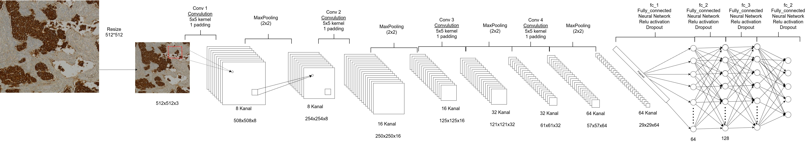
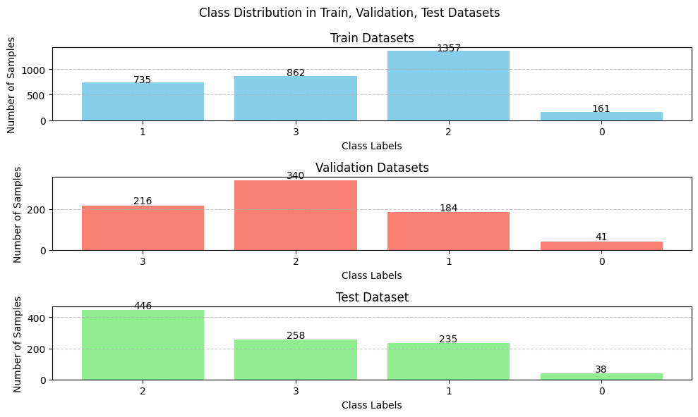
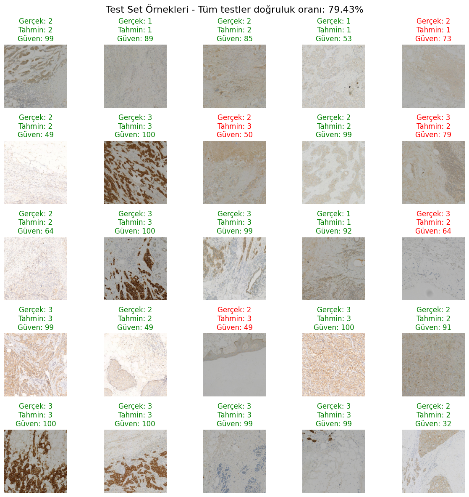

# Medikal Görüntülerde Kanser Tespiti - Derin Öğrenme Projesi

Bu projede, açık kaynaklı medikal görüntüler üzerinde kanserli dokuların tespiti amacıyla Evrişimsel Sinir Ağları (CNN) kullanılarak sınıflandırma modeli geliştirilmiştir.




---

## 🧠 Model Yapısı

### 1. Girdi Hazırlığı

- Görüntü boyutları 1024x1024'ten 512x512'ye düşürülmüştür.
- Veri seti train, validation ve test setlerine ayrılmıştır.

### 2. CNN Katmanı

- 4 katmanlı konvolüsyonel yapı.
- Her katmanda 5x5 kernel, padding ve stride = 1.
- Batch Normalization + ReLU + MaxPooling (2x2).
  
### 3. Sınıflandırıcı Katmanı

- Flatten → Dense → ReLU → Dropout(0.28) → Çıkış Katmanı (4 sınıf).
- Overfitting'i azaltmak için dropout ve batch normalization uygulanmıştır.

---

## 📁 Veri Seti



- Veri seti dengesizdi. Bu nedenle `albumentations` kütüphanesi ile veri artırma yapılmıştır.
- Augmentation: Dönme, kaydırma, kırpma, yatay çevirme gibi işlemler uygulanmıştır.

---

## ⚙️ Hiperparametreler

| Parametre | Değer |
|-----------|--------|
| Batch Size | 64 |
| Epoch | 200 |
| Learning Rate | 0.0015 |
| L2 Regularization | 1e-5 |
| Dropout | 0.28 |
| CNN Kernel Size | 5 |
| EarlyStopping Patience | 90 |
| Scheduler | CosineAnnealingLR & ReduceLROnPlateau |

---

## 📊 Model Sonuçları ve Yorumlar



- Başlangıçta ciddi overfitting gözlemlendi.
- Veri artırımı ile doğruluk oranı %10 → %60 seviyesine çıkarıldı.
- Dropout ve LR Scheduler ile performans artırıldı.
- CosineAnnealingLR ile test doğruluğu: **%79**
- ReduceLROnPlateau ile test doğruluğu: **%68**
- En iyi performans `0.28` dropout ve CosineAnnealingLR ile elde edildi.
- Confusion matrix analizinde özellikle 1. ve 3. sınıflarda yüksek doğruluk elde edildi.

---


## 🚀 Kurulum ve Çalıştırma

1. Gerekli kütüphaneleri yükleyin:
    ```bash
    pip install torch torchvision albumentations matplotlib
    ```

2. Proje dosyasını çalıştırın:
    ```bash
    jupyter notebook bci_tespit.ipynb
    ```

---

## 📝 Notlar

- Eğitim sırasında TensorBoard ile görselleştirme yapılmıştır.
- Model kayıpları ve doğruluk grafikleri ile birlikte analiz edilmiştir.
- Optimizasyon için Adam tercih edilmiştir. SGD ile yeterli sonuç alınamamıştır.

